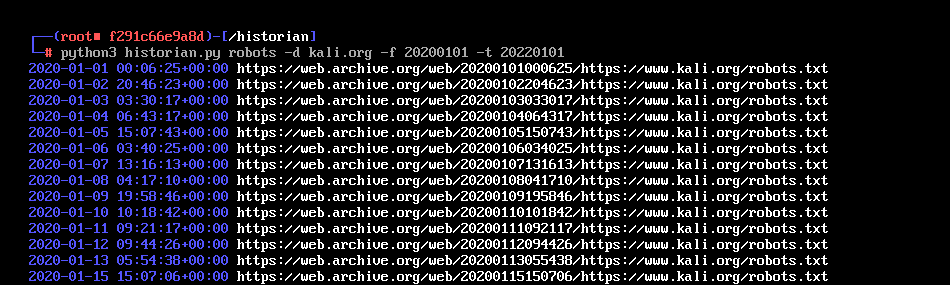
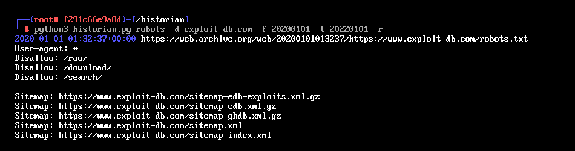
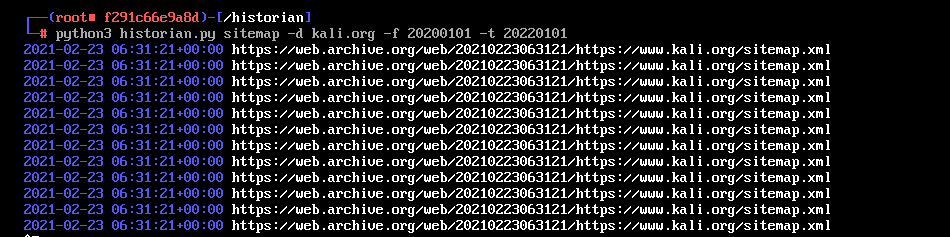

# historian.py
historian.py is python script that use wayback library to check robots.txt and sitmap.xml history




# options
```bash

  positional arguments:

  robots          robots subcommand
  sitemap         sitemap subcommand
  
  options:
  
  -d   example.com  Set target domain
  -f   20020501     From date
  -t   20240501     To date
  -r                Show response
```
## Install requirements 
 ```bash
 pip install -r requirements.txt
 ```
## Usage
### robots
 ```bash
 python3 robots historian.py -d example.com -f 20210610 -t 20240801
 ```
### sitemap
```bash
 python3 sitemap historian.py -d example.com -f 20210610 -t 20240801
```
