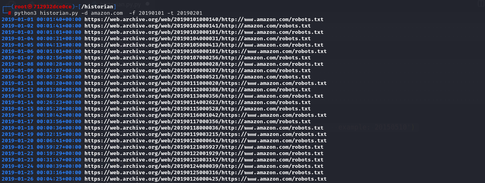

# historian.py
historian.py is python script that use wayback library to check robots.txt history   
## Install requirements 
 ```bash
 pip install -r requirements.txt
 ```
## Usage
 ```bash
 python3 historian.py -d fuzzer.cloud -f 20210610 -t 20240801
 ```
